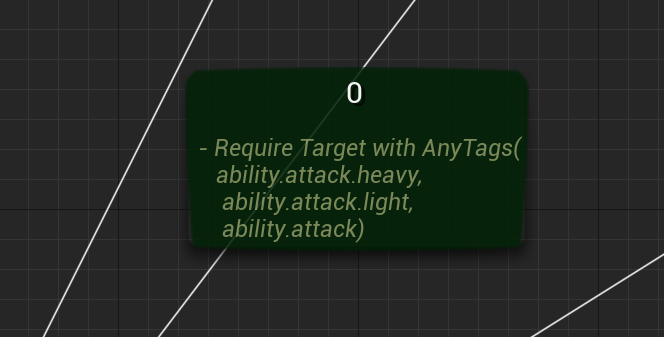

JJaspers Fork - GenericGraphPlugin
==================
Changelist:
 #. Refactored UedNode_GenericGraphNode 'bCanRenameNode' to false.
 	* Allows making title-texts multiple lines to allow for smaller formatted "subtext"
 	* Supported for both edges + nodes

 #. Added support for a secondary background color
	* Useful for implementing debug support to showcase which node is active

-----------------------------------------------

GenericGraphPlugin
==================

Generic graph data structure plugin for ue4

.. image:: docs/images/GenericGraph.png

Feature
-------

* Custom asset type
* UE4 BehaviorTree-like asset editor
* Extendable graph node type
* Extendable graph edge type
* Extendable graph type(new asset type with generic graph editor, C++ only)

Usage
-----

* Ability system
* Dialogue system
* Quest system
* Etc

Install
-------

#. Clone this project to ${YourProject}/Plugins/
#. Generate project file
#. Compile

Tutorial
--------

`Dialogue System`_ (WIP)

Example
-------

Dialogue System and ability system: SRPGTemplate_

.. image:: docs/images/dialogue/dialogue01.png

.. image:: docs/images/dialogue/dialogue02.png

.. image:: docs/images/dialogue/dialogue03.png

.. image:: docs/images/ability-graph.png

.. _Dialogue System: https://jinyuliao.github.io/blog/html/2017/12/15/ue4_dialogue_system_part1.html
.. _SRPGTemplate: https://github.com/jinyuliao/SRPGTemplate
